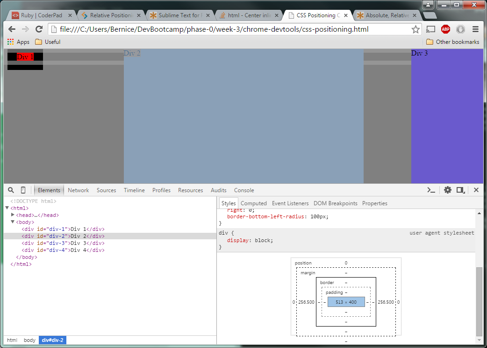
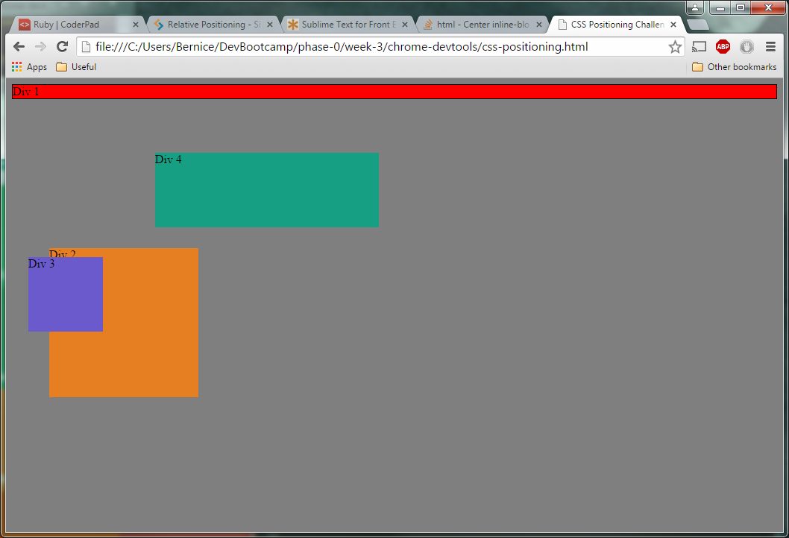
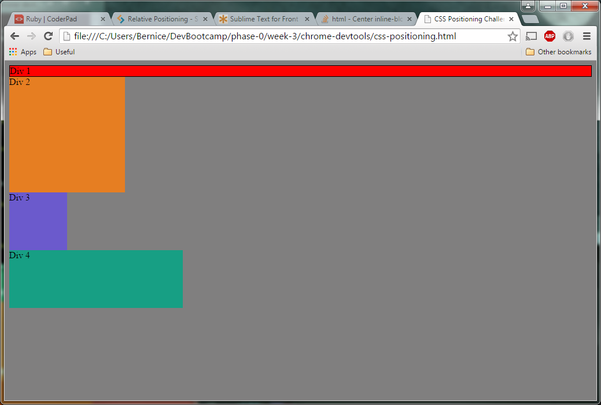
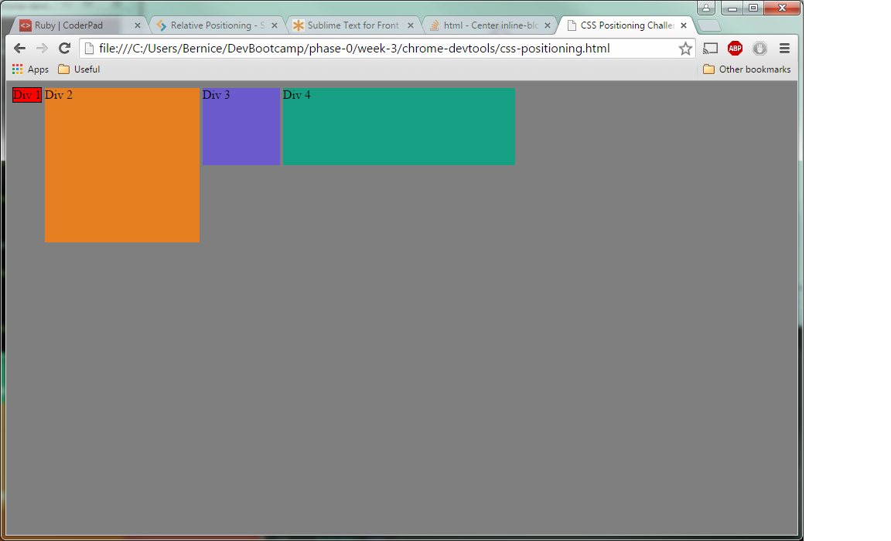
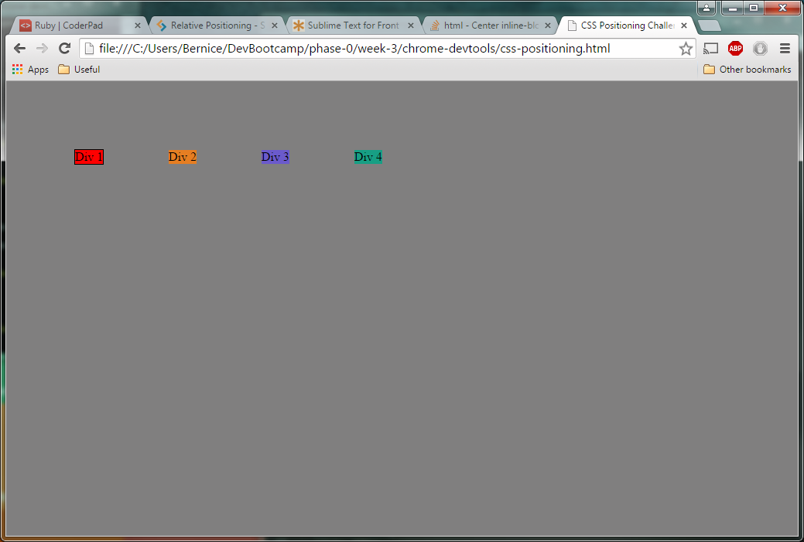
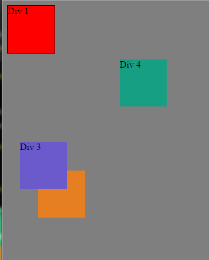
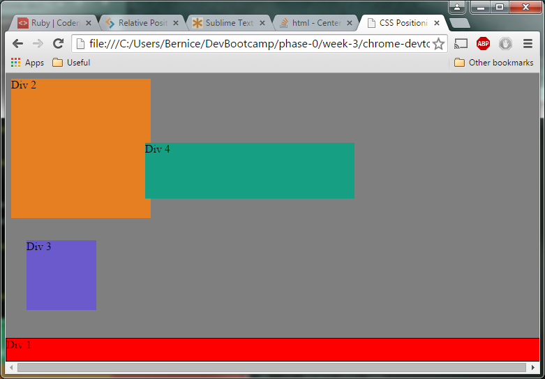
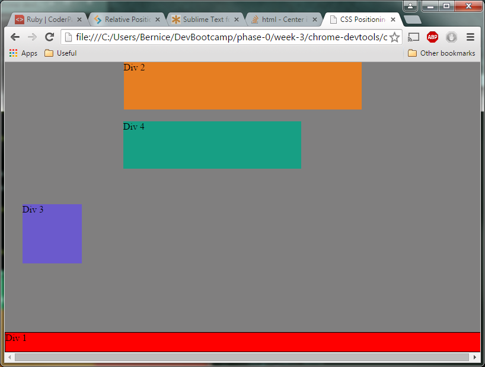
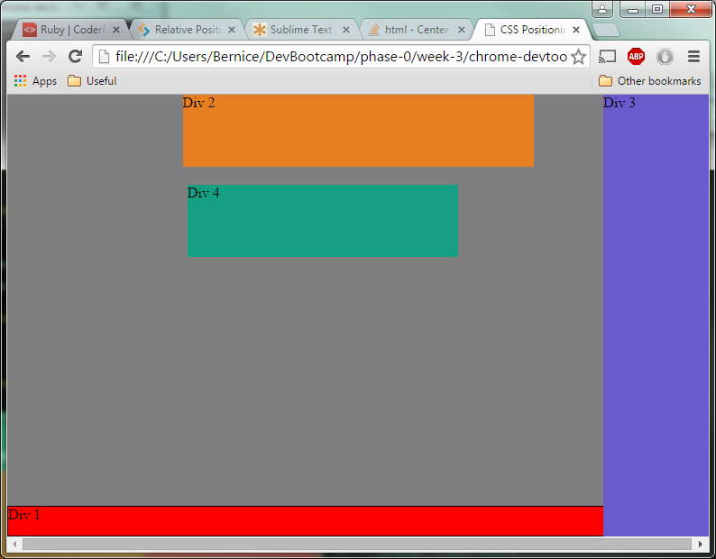
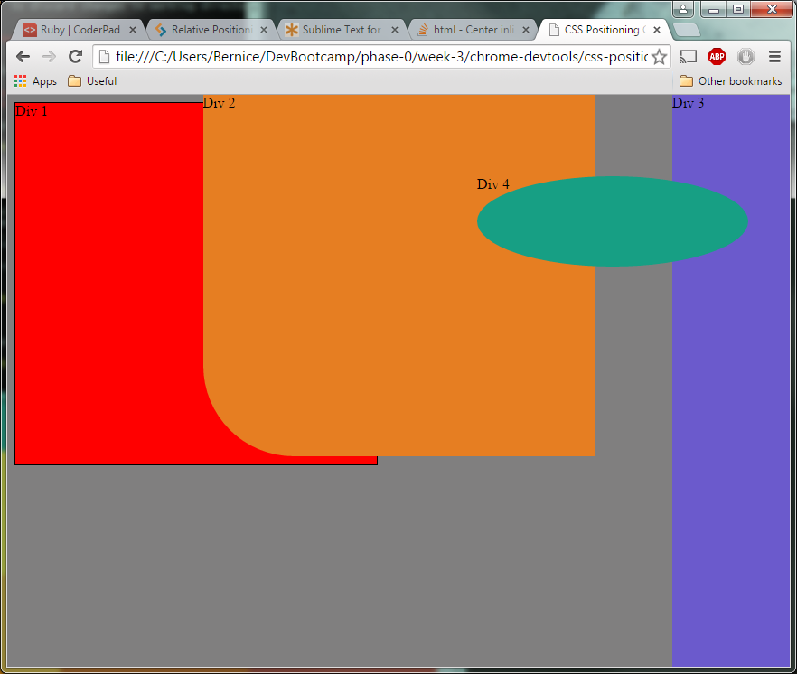

[I. The Reflection](#I.TheReflection)

[II. The Screenshots From "Release 3: Exercises"](#II.TheScreenshotsFrom"Release3:Exercises")

# I. The Reflection
**_How can you use Chrome's DevTools inspector to help you 
format or position elements?_**

Chrome's DevTools inspector is very useful for formatting 
or positioning elements, because we can use it to test 
out what effect something will have on the selected 
element directly on the browser and we can see the change 
instantaneously, sometimes even as easily as unchecking 
the box of that property just to see.  

It is the same as testing the appearance/formatting of 
something through an editor/IDE, but better because we 
didn't need to re-save on the editor then reload the 
page each time.  

Also, there is a section under the "Styles" tab of "Elements" 
which shows the padding, borders, and margins, etc. of an 
element, which makes it easy to visualize why something is 
positioning itself or behaving in an unexpected way (for 
example, I want the position of something to be in the 
center but it's not happening, because the margin is really 
wide.  See screenshot): 

**_How can you resize elements on the DOM using CSS?_**

In CSS, the size of an element on the DOM can be changed by:
* `height` & `width` attributes (pretty self-explanatory)
* `border` attribute = if a border is thick enough, it also 
    increases the size of the element.  
* `display` attribute = if an element has a display 
    property of `block` or `inline-block`, it will retain 
    the shape specified by `height` & `width`.  If the 
    `display` property is set to `inline`, the size of the 
    element will shrink to fit the text inside it.  

**_What are the differences between Absolute, Fixed, Static, and 
Relative positioning? Which did you find easiest to use? Which was 
most difficult?_**

* `static` = default positioning style, if no `position` 
attribute is specified.  Element flows on the page as it 
normally would, based on its sequence in the HTML file.  
* `absolute` = element will be placed exactly where you tell 
it to go.  This works because it is positioned in relation to 
the first parent element that is NOT `position: static;`. If 
there's no such parent element, the element with 
`position: absolute;` gets positioned relative to the 
`<html>` node.  
* `fixed` = it will always be in the same place relative to 
the browser window.  If the user scrolls up and down, the 
fixed element stays put even as other elements scroll past.  
Nice for headers, footers, or sidebar/navigation that need 
to be displayed prominently, but might be troublesome if the 
window resizes or in smaller screens.  
* `relative` = elements move _relative to where it would have 
been_ if it just had the default static positioning.  
`relative` works with other properties/attribues like 
`top`, `right`, `bottom`, `left` attributes.  For example, if 
the element has the attribute `top: 10px;`, this element will 
shift it's position 10 pixels DOWN from where it would NORMALLY 
be.  The `z-index` of a `relative`-ly positioned element will 
always trump a `static`-ally positioned element.  `relative` 
elements can have `absoulte`-positioned child elements inside 
it, and this `absolute` child element will behave as if it is 
inside its own browser window.  

**_What are the differences between Margin, Border, and Padding?_**

* `margin` = distance between the child elements & text that 
live inside an element to the edge of the element.  (Inside 
distance.)  
* `border` = the outline of an element.  
* `padding` = distance between the edge of the selected element 
and the elements surrounding it.  If there's no element 
surrounding it, distance between the selected element and the 
element/container that it stays in.  (Outside distance.)  

**_What was your impression of this challenge overall? (love, 
hate, and why?)_**

This challenge was fun because we were able to play around 
with CSS and make the `div`s move wherever we want and shape 
however we want.  As we worked, we found out about a lot of new 
techniques in CSS, and we kept researching just out of 
curiosity.  This whole thing was made easier because the Chrome 
Dev Tools gave us instant feedback on what we were trying.  And 
even if not for Chrome Dev Tools, it's easy to manipulate the 
formatting from the IDE and see the changes almost right away.  

The only part that was challenging was figuring out the 
size/numbers that we were supposed to use.  As much as possible, 
we tried to use %, em, & rem (the flexible units) instead of the 
fixed units like px & pt, but we were not really that familiar 
with the flexible units, and how big they were really supposed 
to be.  But we got more familiar with them because of the activity.  

# II. The Screenshots From "Release 3: Exercises"
###### Challenge3-4_-_Release3-1-change-color.png

###### Challenge3-4_-_Release3-2-column.png

###### Challenge3-4_-_Release3-3-rows.png

###### Challenge3-4_-_Release3-4-equidistant-5em.png

###### Challenge3-4_-_Release3-5-squares.png

###### Challenge3-4_-_Release3-6-footer.png

###### Challenge3-4_-_Release3-7-header.png

###### Challenge3-4_-_Release3-8-sidebar.png

###### Challenge3-4_-_Release3-9-get-creative.png

